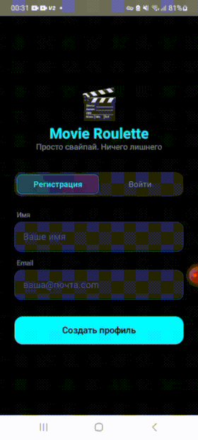

# MovieRoulette

Android-приложение для выбора фильмов свайпами. Свайп вправо — фильм в избранное,
влево — пропустить. Подбор строится на выбранных жанрах и данных TMDB.

<p align="center">
  
</p>

## Возможности

- Авторизация
- Выбор жанров для персонализированной выдачи
- Свайп-карточки с фильмами (вправо — в избранное, влево — пропустить)
- Список избранных фильмов
- Детальная информация о фильме: описание, рейтинг, дата выхода
- Профиль пользователя
- Локальное хранение избранного и кэш жанров

## Технологии

| Слой | Стек |
|------|------|
| UI | Jetpack Compose, Material 3, Navigation Compose |
| DI | Koin |
| Сеть | Retrofit, Moshi, OkHttp |
| Хранение | Room |
| Изображения | Coil |
| Асинхронность | Kotlin Coroutines |
| API | The Movie Database (TMDB) |

Архитектура — Clean Architecture с разделением на слои `data` / `domain` / `presentation`
и паттерном MVVM.

## Запуск

1. Клонировать репозиторий:
   ```bash
   git clone https://github.com/<your-username>/MovieRouletteSwipe.git
   ```
2. Открыть проект в Android Studio.
3. При необходимости указать свой TMDB API-ключ в `app/build.gradle.kts`:
   ```kotlin
   buildConfigField("String", "TMDB_API_KEY", "\"YOUR_API_KEY\"")
   ```
4. Собрать и запустить на эмуляторе или устройстве (minSdk 24).

## Структура проекта

```
app/src/main/java/com/example/movieroulette/
├── data/          # Room (local), Retrofit API + DTO (remote)
├── di/            # Koin-модули
├── domain/        # Модели, репозитории, use-case'ы
├── presentation/  # Экраны Compose и ViewModel'и (auth, genres, main, details, favorites, profile)
└── ui/theme/      # Тема приложения
```
